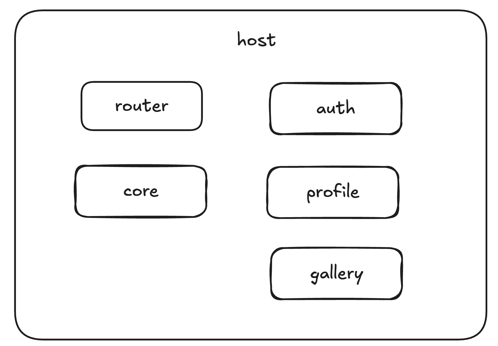
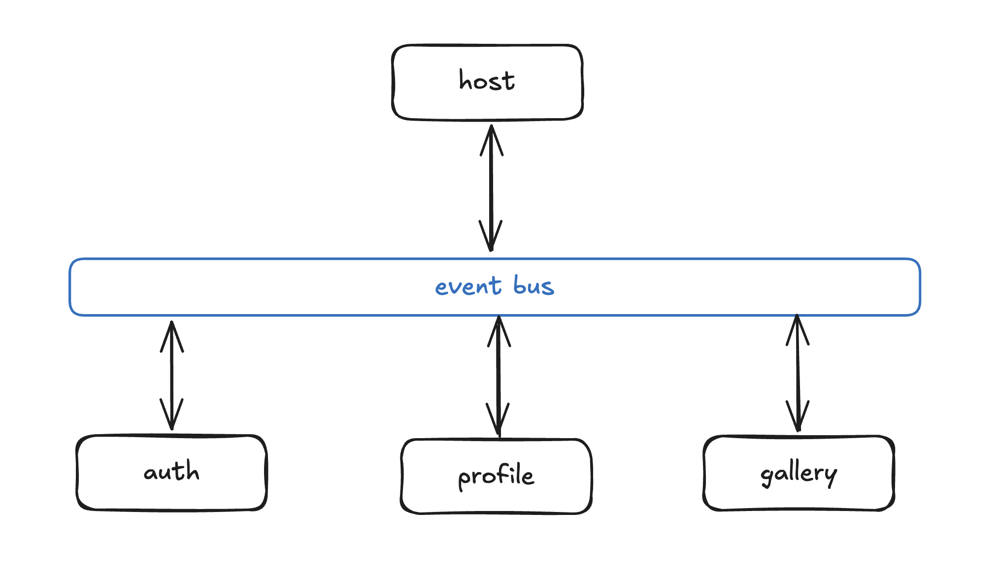

# Проект 1 спринта - Микрофронтенды

## Структура проекта

```
frontend
  |
   -- src
      |
      -- blocks         стили, предположительно БЭМ
      |
      -- components     
      |
      -- contexts       контексты
      |
      -- images         картинки
      |
      -- utils          модули для работы с апи
      |
      -- vendor         внешние зависимости
```

Роутинг:
- /         - только для залогиненных пользователей (<Main>)
- /signin   - страница с формой регистрации (<Register>)
- /signup   - страница с формой логина (<Login>)

## Проектирование



Общее фронтенд приложение (host) содержит роутинг и компонует все микрофронтенды вместе.



Микрофронтенды и хост-приложение взаимодействуют через общую шину событий, отправляя события и подписываясь на них.

## Планирование изменений

Планируется использовать weback module federation.

Список микрофронтендов:

1. auth
2. profile
3. gallery
4. host

Дополнительно нужна директория с общими зависимостями всех микрофронтендов:

```
core
    src
        components
            PopupWithForm
                index.js
            InfoTooltip
                index.js
```

### Auth.

Содерджит все, что относится к авторизации пользователя.

```
auth
    src
        components
            Register
                index.js
                styles.module.css
            Login
                index.js
                styles.module.css
            Header
                index.js
        utils
            api.js                 методы login, register
```

### Profile

Содерджит все, что относится к отображению и изменению профиля пользователя.

```
profile
    src
        components
            EditAvatarPopup
                index.js
            EditProfilePopup
                index.js
        utils
            api.js                 методы setUserInfo, setUserAvatar
        
```

### Gallery 

Содержит компоненты для отображения карточек, галереи, добавления нового места

```
gallery
    src
        components
            AddPlacePopup
                index.js
            ImagePopup
                index.js
            Card
                index.js
            Gallery                список карточек
                index.js
                styles.module.css
        utils
            api.js                 методы addCard, changeLikeCardStatus, removeCard
        
```

### Host

Глафное фронтенд приложение, которое импортирует остальные микрофронтенды. Содежит в себе верстку и роутинг

```
host
    src
        components
            Footer
                index.js
            App                     роутер + импорты компонентов из микрофронтендов
                index.js

```